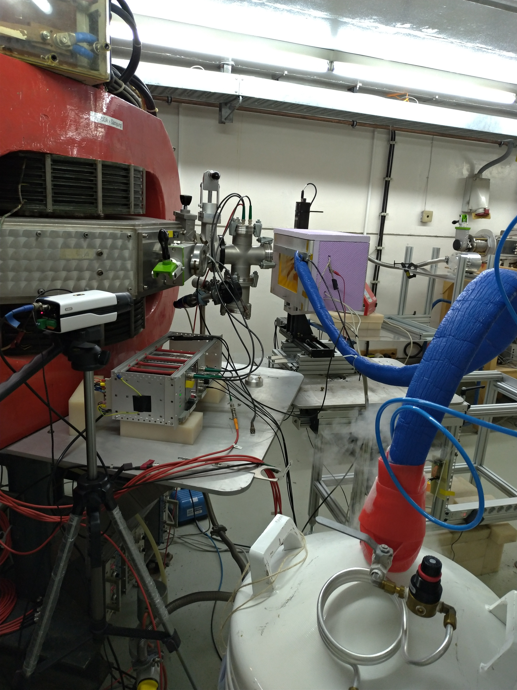

[Silizium Labor Bonn](https://github.com/SiLab-Bonn)

( Last modified: {{ site.time | date: '%B %d, %Y' }} )

---
# Feel free to add content and custom Front Matter to this file.
# To modify the layout, see https://jekyllrb.com/docs/themes/#overriding-theme-defaults

layout: default
---
<h1> Proton Irradiation Site for Silicon Detectors at Bonn University </h1>
A newly-installed proton irradiation site at the [Bonn isochronous cyclotron](https://www.zyklotron.hiskp.uni-bonn.de/zyklo_e/index.html) at the [Helmholtz Institut für Strahlen- und Kernphysik (HISKP)](https://www.hiskp.uni-bonn.de/) allows radiation damage studies of prototype silicon detectors for state-of-the-art, high-energy physics experiments such as [**ATLAS**](https://atlas.cern/) and [**BELLE 2**](https://www.belle2.org/). Especially pixel detectors are positioned close to the interaction point due to their high spatial resolution and tracking capabilities. Therefore, they are exposed to a harsh radiation environment which dictates their lifetime. In order to verify that the detectors meet requirements, radiation damage studies are necessary for prototype detector concepts.

<h3> Setup </h3>
<figure>
  
  
  <figcaption>Overview of the irradiation site at the high current room of the Bonn isochronus cyclotron. The setup consists of an insulated cooling box on a two-dimensional motor stage which is
mounted on a custom-made setup table. A liquid nitrogen reservoir is used to cool nitrogen gas which is guided into the
cooling box.Shown is  the setup in irradiation position, only several centimeters from the extraction
window.</figcaption>
</figure>

<h3> Beam Diagnostic</h3>
In order to determine the beam current and position in the xy-plane non-destructively, a 4-channel
secondary electron monitor (SEM) is used.  

<h3> Irradiation Characteristics </h3>

|         |
| :------- | :------- |
| Energies| 7 to 14 MeV per nucleon|
|Ions|Proton to Oxygen|
|Beam intensity internal / external | max. 10 µA|

<h3> Fluence Estimation </h3>
The proton fluece  is directly proportional to the NIEL damage. Knowing the proton beam current , the fluence is calculated by

