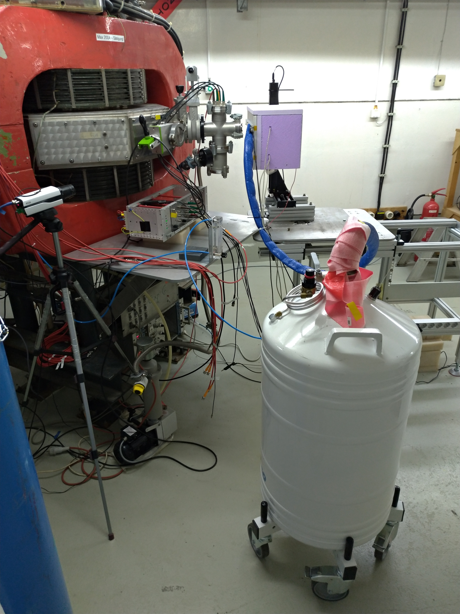
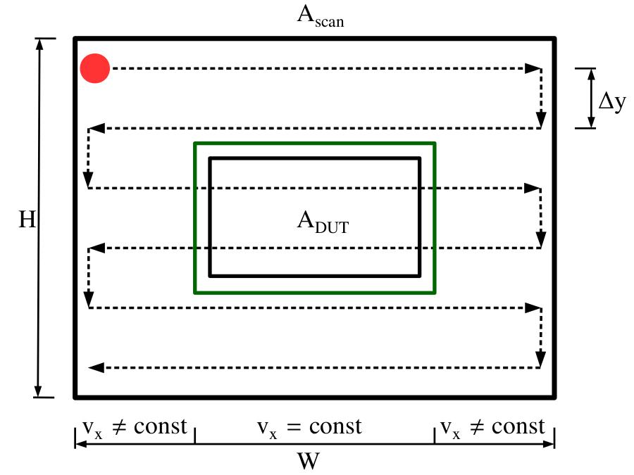
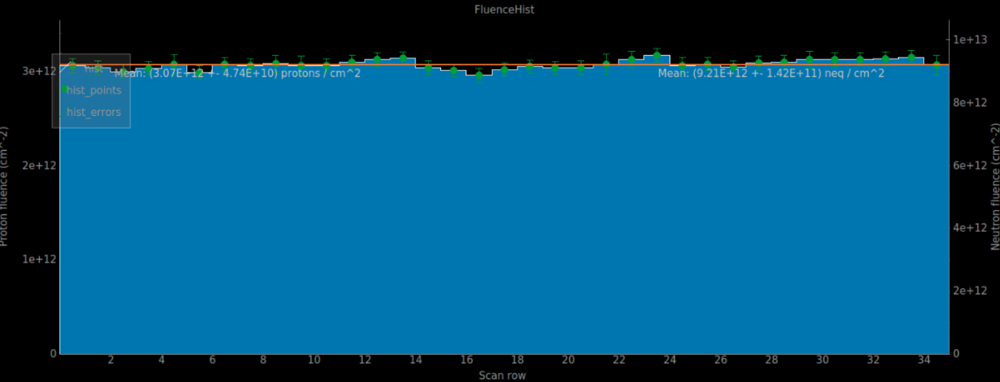
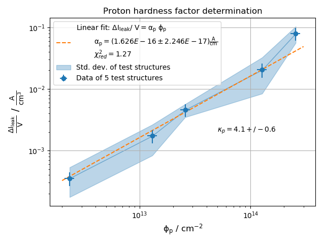
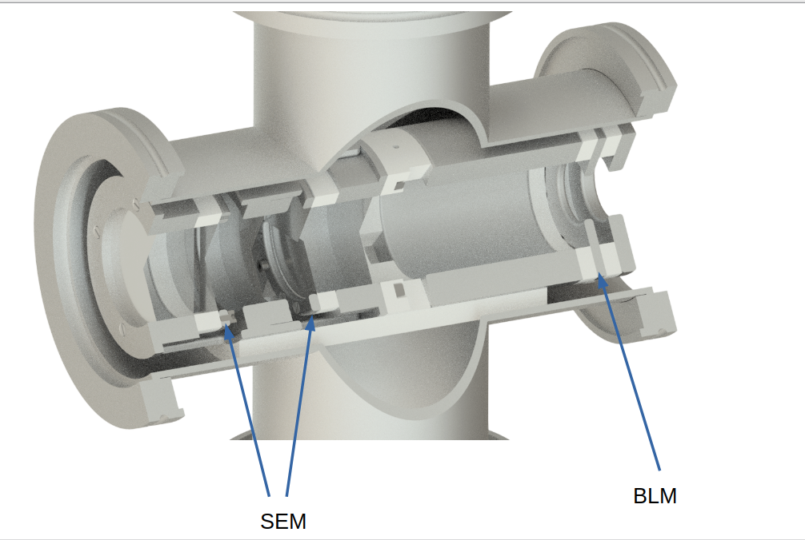
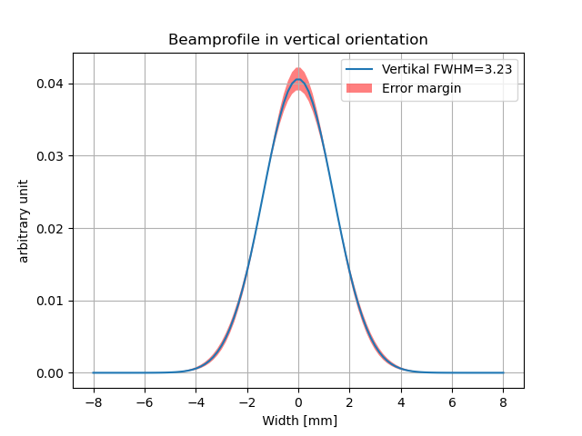
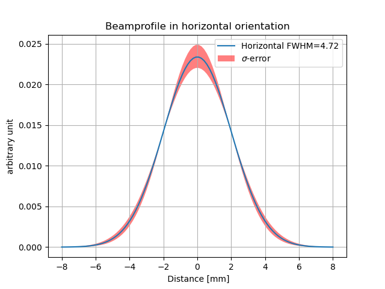
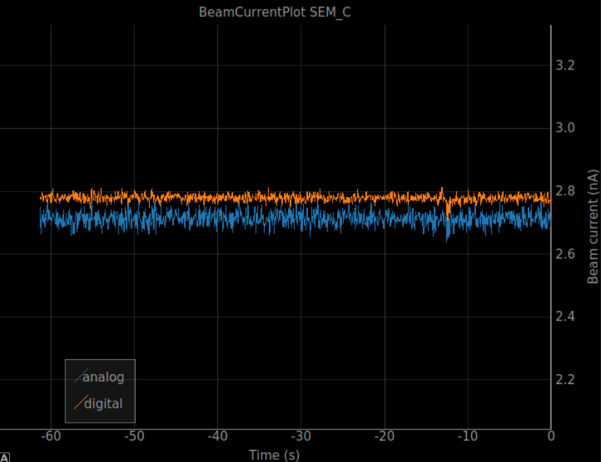
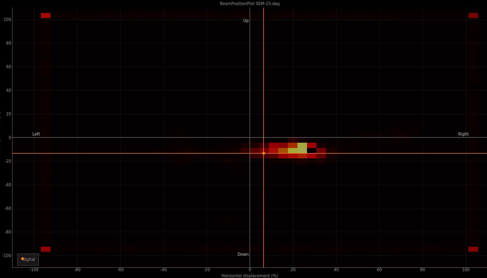

[Silizium Labor Bonn](https://github.com/SiLab-Bonn)

( Last modified: {{ site.time | date: '%B %d, %Y' }} )

  

<h3> Setup </h3>

<figure>
  

    
  

  <figcaption>Overview of the irradiation site at the high current room of the Bonn isochronus cyclotron. The setup consists of an insulated cooling box on a two-dimensional motor stage which is
mounted on a custom-made setup table. A liquid nitrogen reservoir is used to cool nitrogen gas which is guided into the
cooling box.Shown is  the setup in irradiation position, only several centimeters from the extraction
window.</figcaption>
</figure>

<h3> Proton irradiation Characteristics </h3>
<table class="table">
<tr> <td> Energies</td><td>14 MeV per nucleon(~12.5 MeV on DUT)</td></tr>
<tr> <td>Beam current</td><td> 20 nA - 2 μA</td></tr>
<tr> <td>Typical beam width</td><td>4/6 mm x/y</td></tr>
<tr> <td>Temperature at DUT</td><td>19 cm x 11 cm</td></tr>
<tr> <td>max. DUT thickness (Si)</td><td>300 μm</td></tr>
  </table>

<h3> Fluence Determination </h3>
The proton fluence  is directly proportional to the NIEL damage. Knowing the proton beam current , the fluence is calculated by

This equation describes the fluence per complete scan of the respective area, with  the electric charge, , the scan speed and  the step size.

<figure>

  

</figure>
Shown is the the schematic scanning procedure, the beam spot (red circle) is moved in a grid over the scanned  area
, separated into H/∆y rows. The DUT  is placed inside the green
rectangle, where the scan speed is constant.
<figure>

  

</figure>
The fluence is measured with 20 to 200 Hz within each row, while one gets ∆y and v from the XY-Stage. Shown is a Histogram of the fluence per scanned row of one set of irradiated diodes. The proton
fluence is indicated on the first, the neutron fluence  on the second y-axis. The
mean fluence over the entire scan area is given by the horizontal line.
<h3> Proton hardness factor </h3>
<figure>

  

</figure>

For our 14 MeV protons we determined a hardness factor of 4.1 ±0.6. We used thin 200 μm LFoundry test structures.

<h3> Beam Diagnostic</h3>

  

In order to determine the beam current and position in the xy-plane non-destructively, a 4-channel secondary electron monitor (SEM) is used.
In front of the extraction the Beam penetrates a 4-channel secondary electron monitor. The penetration is directly proportional to the beam current. So it is possible to determine the beam current and position in the xy-plane non-destructively.
After the SEM the Beam goes through a Beam-loss-monitor (BLM), which is based on a faraday cup. Through the BLM, it is possible to determine the exact beam extraction current, if the beam is displaced and it is possible to determine the profile of the Beam by moving the Beam completely on the BLM and by adapting an integral of a gaussian function on the data.

  
  

The beam goes then though an exit window and encounters the device.

<figure>

  
  

  <figcaption> Shown are the Visualizations of beam data, available in the online monitor tab of the irrad_control GUI using the installed  SEM. The first figure shows the beam current over time while the no beam is extracted. The second figure shows the relative beam position at the location of the SEM.
</figcaption>
</figure>

